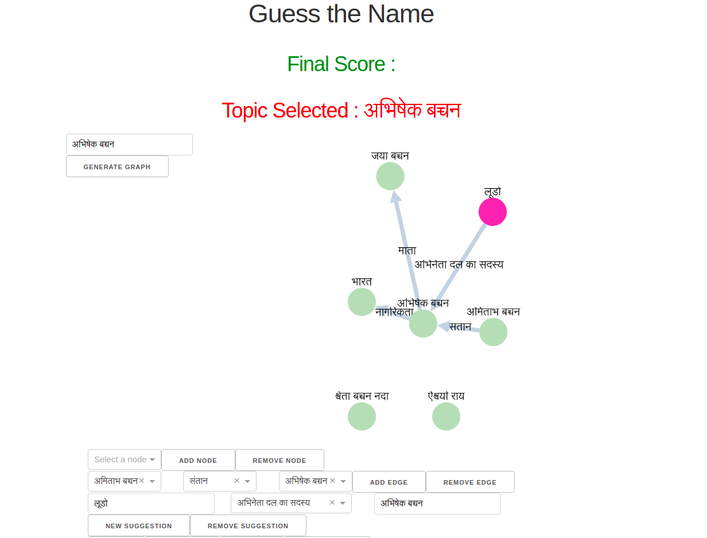

# Guess the Name


Crowdsourcing information to fill gaps in hindi wikidata
[Youtube Link](https://www.youtube.com/watch?v=_rT9ruQt0E0&t=159s)
Find connections between different personalities and places and make suggestions if things are missing

## Installation
### Backend
The backend requires SPARQL and rdflib to work
`pip install -r requirements.txt`

### Frontend
Play the game by running the following commands

```
cd interface
source .envrc
pip install -r requirements.txt
flask db init
flask db migrate -m 'init'
flask db upgrade
flask run
```
